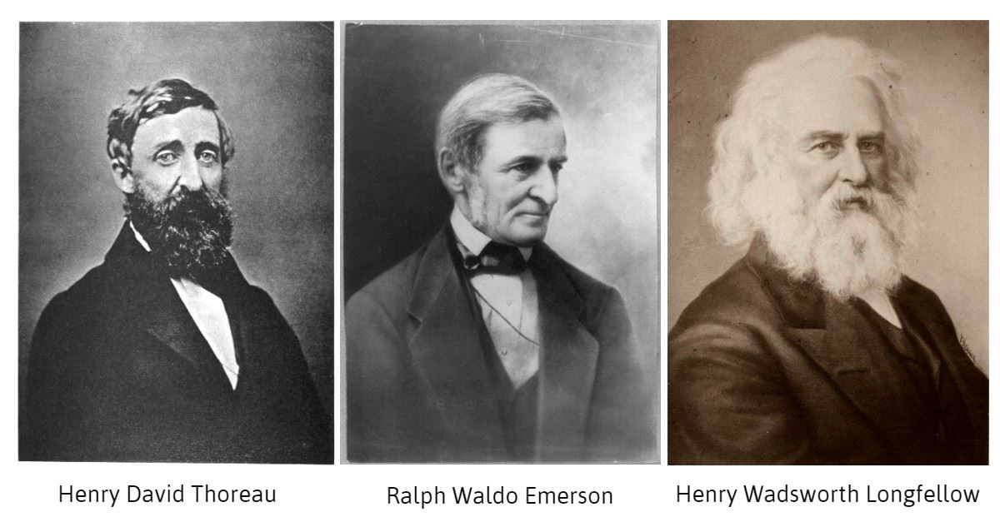

From the moment we are born, there are expectations placed on us: go to school, find a job, start a family, build a life. Society gives us a blueprint on how to live a “meaningful” life. However, existentialism fundamentally rejects the premise that we have some “predetermined” purpose; instead, it suggests that it is up to an individual to find purpose in their life. Existentialists become aware of the “absurdity” of human existence: the fact that life itself lacks any inherent meaning beyond what we choose to give it. This problem, where humans seek purpose in a universe that offers none, leads to a dilemma: should we accept the illusion of meaning from society, or should we create our own?

However, it’s not all depressing (in fact, it’s quite the opposite). If the existentialists are right and there is no inherent meaning in life, then every moment becomes an opportunity to create meaning for yourself. Through art, activism, and self-expression, existentialists have found ways to thrive in the absurdity of existence rather than give in to it. This mindset, originating from philosophical backgrounds, has fueled counterculture in American society for over 150 years. From the 19th-century transcendentalists to the Beat Generation, the 1960s hippies, punk rock anarchists, and modern-day internet nihilists who turn existential dread into memes, this existentialist mindset has been shared across generations. Existentialism and counterculture have shaped American identity by fighting societal norms, developing new artistic and philosophical movements, and influencing change from the 19th century to the present.

The roots of counterculture in the United States surprisingly predate existentialism, as the first major movement that rebelled against society and emphasized the individual experience was transcendentalism (1830s-1850s). Major transcendentalists, such as Ralph Waldo Emerson and Henry David Thoreau, rejected materialism in their society. Instead, they celebrated individualism and a connection to nature. Emerson’s essay Self-Reliance argues the need for one to be their true, authentic self, while Thoreau’s Walden detailed his retreat into the woods, an experiment in living outside society. These writers shared the idea that meaning shouldn’t come from society, it comes from the self. In addition, another impact on counterculture from transcendentalism was through Thoreau’s essay Civil Disobedience, which argued that citizens have the moral duty to oppose unjust laws. 


  
 

A century later, the Beat Generation (1940s-1950s) rose to importance as a result of the existential crisis of post-World War II America. Writers such as Jack Kerouac and Allen Ginsberg became disillusioned with the consumerism and conformity of post-war society and sought for meaning through exploration and authenticity. Kerouac’s On the Road described the search for meaning through the travels of Sal Paradise and Dean Moriarty as they aimlessly wander throughout the United States. Ginsberg explores the spiritual emptiness of America in his poem Howl. Works by Beat Generation authors were heavily influenced by existentialist philosophers like Albert Camus and Jean-Paul Sartre, who saw life as an absurd, unpredictable journey that should be lived authentically. 

This anti-mainstream sentiment carried over into the 60s and 70s, with the development of hippie culture and anti-war sentiments. Hippies, like the existentialists before them, rejected traditional values in favor of peace. However, hippies turned to Eastern philosophy (Buddhism and Hinduism) as a way of understanding human existence beyond Western ideas of success and materialism. Hippies found meaning and “enlightenment” in meditation and psychedelic experiences. Music played a major role in hippie culture, with musicians such as Bob Dylan and The Doors questioning authority and society in their lyrics. 

Hippie culture was fueled by arguably the most significant existential crisis of all time, the Vietnam War. This forced many Americans to come to grips with the absurdity of life and death, and what it means to give your life to a cause you don’t truly believe in. This mass existential dread led to widespread protests and a rise in anti-war sentiment across the nation, as many couldn’t come to terms with sacrificing their lives for a cause they did not believe in. People were rejecting the previous societal expectations of citizens joining the army to be war heroes and choosing to define their own purpose.

By the 1990s, the grunge movement embodied the existential crisis of a new generation. Unlike the hippie movement of the 70s, the grunge movement focused on apathy, alienation, and a quiet despair faced by the younger generations. The grunge movement expressed the frustration of a generation that felt disillusioned with the promises of capitalism and corporate greed. Kurt Cobain became the frontman for the grunge movement: he essentially symbolized the existential “angst” felt by those who couldn't find themselves or conform to expectations. This era reflected the frustration of Sartre’s notion of “bad faith,” where people live according to external pressures rather than authentic personal choices. Many in Generation X grew up watching their parents prioritize wealth at the cost of happiness, and they rejected the idea that financial success leads to a meaningful life. 

However, thanks to the power of the internet and meme culture, existentialism has risen to new heights. Instead of protests in the streets, memes and online communities have become the new battlegrounds for existential crises. Meme culture thrives on dark humor to address significant existential fears while also acknowledging the inability of a single individual to change the system. These past 20 years have been extremely turbulent as well, leading to many adopting a “doomer” mentality. This mindset revolves around the futility of existence and the inevitability of societal collapse and reflects the experiences of a generation raised on economic, climate, and political chaos. Unlike past countercultures that sought to change the world through activism or art, modern digital countercultures often mock the idea of meaning itself, reflecting an even deeper level of existential absurdity. Characters such as Patrick Bateman from American Psycho,K from Blade Runner 2047, and Batman all trend on social media because of their fundamentally existential character traits, which resonate with social media users. Today’s counterculture is focused on bits and pieces as content condenses itself into short-form content and social media posts. The existential crisis of the 21st century has simply found a new medium of expression.

---