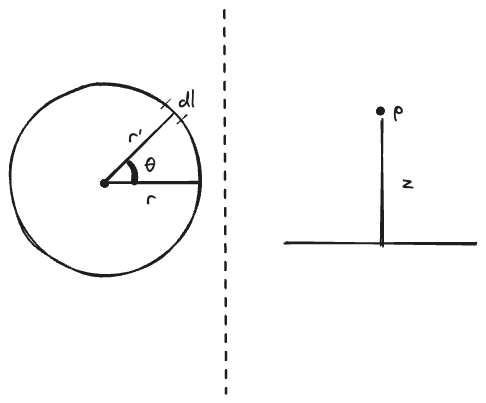
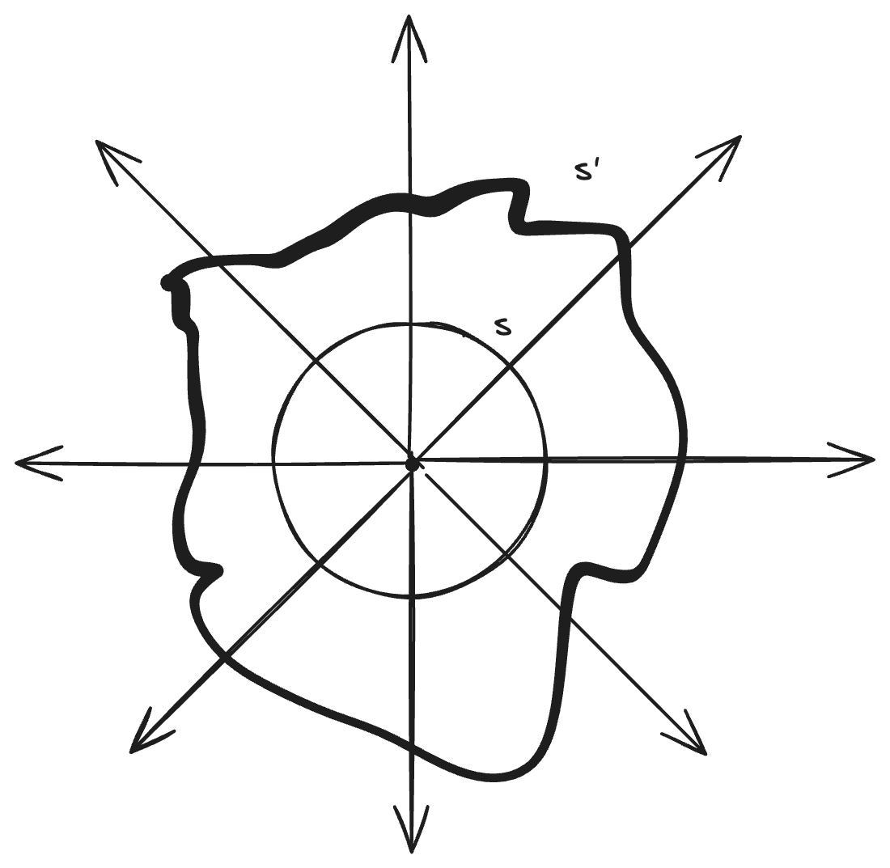
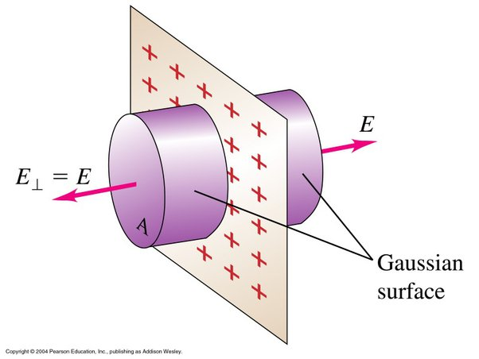

> Update: This article is the reason I got a five on AP Physics C, one year later.

# Introduction
Gauss's Law is a law that relates the flux of the electric field on a surface to the charge enclosed within that surface. What does that even mean? In this article, I want to walk you through the basics of electromagnetism and make it seem like even you could have derived this law if you knew what Gauss knew. 

A special thank you to Professor Ramamurti Shankar for describing this intuitive way of explaining Gauss's Law. 

# Coulomb's Law

Some particles have an intrinsic property called charge. Because charges come from particles, charge must be "quantized", or come in discrete amounts. We know charge is always in multiples of $1.6 * 10^{-19}$ coulombs. This number is called $e$, or the elementary charge. This is the charge of a proton, and an electron has charge $-e$. 

To understand how charges interact with other charges, it might be helpful to recall how gravity works. We use Newton's Law of Universal Gravitation to describe the gravitational force:

$$\vec{F}_g = G\cdot\frac{Mm}{|\vec{r}|^2} \hat{r}$$

where $G$ is the gravitational constant, $M$ and $m$ represent the mass of two different objects, $\vec{r}$ is the vector that represents the distance between the two bodies, and $\hat{r}$ is a unit vector that points in the same direction as the distance between the two bodies. 

However, what happens when we only examine one body? We get what is known as a field. The gravitational field of a body is a property that all bodies with mass have. We write it as:

$$g = \frac{\vec{F}_g}{m} = \frac{GM}{|\vec{r}|^2}\hat{r}$$

This law is very similar to Coulomb's Law, which describes the force between two charges.

Let's say we have two charges, $q_1$ and $q_2$. We know that they have to exert some force on each other. This is described by Coulomb's Law:

$$\vec{F}_e = \frac{1}{4\pi\varepsilon_0}\cdot\frac{q_1q_2}{|\vec{r}|^2}\hat{r}$$

The first term is Coulomb's constant (also written as $k$). The next term relates the product of the charges divided by the distance between them, and the third term creates a unit vector pointing in the direction of the distance between the charges. This allows us to create a force that points in the direction of the distance. Most introductory physics student have seen a form of this law.

However, what happens when we have only one charge? We can use the same method that we used to create the gravitational field, and get the electric field:

$$\vec{E}(\vec{r}) = \frac{\vec{F}_e}{q_2}=\frac{1}{4\pi\varepsilon_0}\cdot\frac{q}{|\vec{r}|^2}\hat{r}$$

Similar to the gravitational field, whenever there is a charge present, there will be an electric field.

# Electric Field of a Loop

Let's get some practice with integrals and the electric field. If this doesn't make sense, you can totally skip it. This is mainly just meant to show the work involved in calculating the electric field without Gauss's Law. 

Suppose we have a loop of radius $r$ and linear charge density $\lambda$. We want to find the electric field at a point $p$ near it. We can use the definition of the electric field and some integral calculus to do this. 

Let's draw our situation out:

So, let's define a few things. The total charge is the linear charge density multiplied by the circumference of the loop We can solve this problem by dividing this ring into tiny sections of length $dl$. We can denote the position of $dl$ with a vector $\vec{r'}$. We can denote the position of $p$ with a vector. Let's write these out:

$$Q=2\pi r \lambda$$

$$\vec{r}'=<r\cos \theta , r\sin \theta, 0>$$

$$\vec{p} = <0, 0, z>$$

The distance between the point $p$ and dl can be written as the magnitude of a vector $\vec{R}$:
$$|\vec{R}|=\sqrt{r^2+z^2}$$

And the charge of $dl$ is:

$$dq = \lambda dl$$

Now, we can write the electric field formula for $dl$:

$$d\vec{E}(\vec{r}) = \frac{1}{4\pi\varepsilon_0} \cdot \frac{dq}{|R|^2} \hat{R}$$

To find $\hat{R}$ we use:

$$\hat{R} = \frac{\vec{p}-\vec{r}'}{|\vec{R}|} = \frac{<0, 0, z> - <r \cos \theta, r \sin \theta, 0>}{\sqrt{r^2+z^2}}$$

$$\hat{R} = \frac{<-r\cos \theta ,\ -r\sin \theta ,\ z>}{\sqrt{r^2+z^2}}$$

Now, we can write:

$$d\vec{E}(\vec{r}) = \frac{1}{4\pi\varepsilon_0} \cdot \frac{\lambda dl}{r^2+z^2} \cdot \frac{<-r\cos \theta ,\ -r\sin \theta ,\ z>}{\sqrt{r^2+z^2}}$$

Now, by the symmetry of the loop, we know that the net electric field in the x and y direction will cancel, leaving only a net field in the z direction. Therefore, we can drop the x and y components of $\hat{R}$ and get:

$$d\vec{E}_z(\vec{r}) = \frac{1}{4\pi\varepsilon_0} \cdot \frac{\lambda dl}{r^2+z^2} \cdot \frac{z}{\sqrt{r^2+z^2}}$$

We have one last modification to make before we integrate. Recall that 

$$ s = r\theta$$

By this logic, 

$$dl = r d\theta$$

We can finally write

$$d\vec{E}_z(\vec{r}) = \frac{1}{4\pi\varepsilon_0} \cdot \frac{\lambda r d\theta}{r^2+z^2} \cdot \frac{z}{\sqrt{r^2+z^2}}$$

Which collapses into 
$$d\vec{E}_z(\vec{r}) = \frac{\lambda r d\theta z}{4\pi\varepsilon_0 (r^2+z^2)^{3/2}}$$

Now, we can integrate. Writing this out, we get:

$$\vec{E}_z(\vec{r}) = \int_0^{2\pi}\frac{\lambda r d\theta z}{4\pi\varepsilon_0 (r^2+z^2)^{3/2}} = \frac{\lambda r z}{4\pi\varepsilon_0 (r^2+z^2)^{3/2}} \cdot \int_0^{2\pi}d\theta$$

Solving this (very easy) integral, we get

$$\vec{E}_z(\vec{r}) = \frac{\lambda r z}{4\pi\varepsilon_0 (r^2+z^2)^{3/2}} \cdot 2\pi= \vec{E}_z(\vec{r}) = \frac{\lambda r z}{2\varepsilon_0 (r^2+z^2)^{3/2}} $$

That's our answer! We can write this alternatively, using $\lambda = \frac{Q}{2\pi r}$, to get another answer as 

$$\vec{E}_z(\vec{r}) = \frac{Qz}{4\pi\varepsilon_0 (r^2+z^2)^{3/2}}$$

This result will be important. 

# Electric Field Around an Infinite Sheet

Suppose we have an infinite sheet extending in the xy plane, and we want to know the electric field at a point p. The sheet has a surface charge density $\sigma$. We can divide the surface into small rings of radius $r$ and width $dr$ and then integrate them to find the net E-field at the point. 

We rewrite our result from last time:

$$d\vec{E}_z(\vec{r}) = \frac{dq\cdot z}{4\pi\varepsilon_0 (r^2+z^2)^{3/2}}$$

To find the charge for each small ring $dq$, we can use the properties of surface charge density to find:

$$dq=2\pi r\cdot dr\cdot \sigma $$

Substituting this into our answer, we get:

$$dE_z=\frac{2\pi r\cdot dr\cdot \sigma \cdot z}{4\pi \varepsilon _0\left(r^2+z^2\right)^{\text{3/2}}}$$

Cancelling out like terms, we can get our final form:

$$dE_z=\frac{r\cdot dr\cdot \sigma \cdot z}{2\varepsilon _0\left(r^2+z^2\right)^{\text{3/2}}}$$

Now, it's time to integrate. 

$$E_z=\frac{\sigma z}{2\varepsilon _0}\cdot \int _0^{\infty }\frac{r\cdot dr}{\left(r^2+z^2\right)^{\text{3/2}}}$$

This integral is not as easy as last time. We can use the properties of u-substitution to solve this integral.

$$u=r^2+z^2$$

$$du=2rdr$$

And when $r=0$, $u = z^2$. Therefore, we can use u-subsitution to write

$$E_z=\frac{\sigma z}{2\varepsilon _0}\cdot \int _{z^2}^{\infty }\frac{du}{2u^{\text{3/2}}}$$

I would explain how to solve this integral, but I was too lazy and used Mathway to solve this. Regardless, integrating and using the properties of indefinite integrals, we can expand this as:

$$E_z=\frac{\sigma z}{2\varepsilon _0}\cdot \lim _{t\to \infty }\left(-\frac{1}{\sqrt{t}}+\frac{1}{\sqrt{z^2}}\right)$$

Taking the limit, we get:

$$E_z=\frac{\sigma z}{2\varepsilon _0}\cdot \frac{1}{z}$$

Which just simplifies as

$$\vec{E}(\vec{r})=\frac{\sigma }{2\epsilon _0}$$

This shows that the field is constant for an infinite sheet. However, this was a real pain in the butt to solve for. What if there was an easier way? This is where Gauss's Law comes in. 

# Area Vectors

First, let's define what an area vector is. To locate a plane in space, we can draw a vector normal to the plane whose magnitude is the area of the plane. This allows us to find the flux on a surface, which is how much of a quantity flows through a plane. We write flux as:

$$\Phi = \vec{A} \cdot \vec{V}$$

Where V is any vector flowing into the surface. 

## Deriving Gauss's Law

In the image above, we have a charge with radiating E-field lines. We have two surfaces enclosing it, a sphere $s$ and an irregular shape $s'$. We know from the drawing that the number of lines crossing $s$ is the same number of lines crossing $s'$.

We can define line density as:

$$\text{line density}=\frac{\text{lines}}{\perp \ \text{area}}$$

Now, the farther the lines go out, the less dense they become. Therefore, line density follows the inverse square law. We can write that

$$\text{line density}\propto \frac{q}{r^2}$$

This equation states that line density is proportional to charge over radius squared (inverse square law).

We also know from Coulomb's law that

$$E\left(\vec{r}\right)\propto \frac{q}{r^2}$$

Therefore, we can draw the conclusion that the electric field and line density are proportional to each other. So we know that they have to be equal when multiplied by some constant of proportionality.

$$\text{line density}=c\cdot E\left(r\right)$$

where c is some constant of proportionality. Now, remember that the number of lines on the sphere $s$ and the surface $s'$ are the same. We can define the number of lines as the flux of the electric field. 

$$\Phi _s=\text{line density}\cdot \text{area of sphere}=cE\left(r\right)\cdot 4\pi r^2$$

Now, for the complicated surface, we need to do something called a surface integral. The surface integral allows us to slice a complex surface into tiny rectangles and add them up again. Finding the flux for $s'$, we write:

$$\Phi _{s'}=\text{line density}\cdot \text{area of surface}=c \oint_S E\left(\vec{r}\right)\cdot d\vec{A}$$

Now, we can equate both statements to write:

$$cE\left(r\right)\cdot 4\pi r^2=c\cdot \oint E\left(\vec{r}\right)\cdot d\vec{A}$$

Cancelling like terms, we get

$$c\cdot \frac{q}{\varepsilon _0}=c\oint_S \vec{E}\cdot d\vec{A}$$

Cancelling our constant, we get:

$$\oint_S \vec{E}\cdot d\vec{A}=\frac{q}{\varepsilon _0}$$

This is Gauss's Law! We can keep going however. What happens when we have two charges enclosed in a surface? Using the superposition principle, we can write

$$\oint_S \vec{E}_1\cdot d\vec{A}+\oint_S \vec{E}_2\cdot d\vec{A}=\frac{q_1}{\varepsilon _0}+\frac{q_2}{\varepsilon _0}$$

Suppose we have a continuous blob of charge with charge density ρ. We can rewrite the above equation as

$$\oint _s\ \vec{E}\cdot d\vec{A}=\iiint_V \rho(x, y, z)dxdydz$$

Where the triple integral is a volume integral. This may look strange, but think about it logically. The charge density multiplied by the volume of a shape should logically be the charge enclosed by the shape. 

Simply put, **Gauss's law relates the electric flux of a surface to how much charge is enclosed by that surface**. Now that we have Gauss's Law, we can use it to solve a few things quicker. 

# Infinite Sheet: Gauss-Style

Redfine our infinite sheet, and instead of integrating rings, we're going to use something called a "gaussian surface" to solve this problem. A suitable choice is a cylindrical pillbox (a short cylinder) that straddles the sheet, with its flat faces parallel to the sheet.

This image shows a pillbox extending from both ends of the surface. Due to the symmetry of the infinite sheet, the electric field must be perpendicular to the surface of the sheet and have the same magnitude at any point from the sheet on both sides.

For the pillbox, the charge enclosed ($q_{enc}$) is:

$$q_{enc} = \sigma A$$

Where $A$ represents the area of the flat side of the the pillbox. 

To solve for the flux, the angle between the area vector of the flat side of the sheet is 0. The angle between the curved surface and the electric field is 90 degrees. Therefore, our flux (the cosine of the angle times the magnitude of the two vectors) is:

$$\oint _S\ \vec{E}\cdot d\vec{A} = E\cdot A = EA$$

However, it extends on both sides, so we rewrite as:

$$\oint _S\ \vec{E}\cdot d\vec{A} = E\cdot A + E\cdot A = 2EA$$

Now, after solving both sides, we can use Gauss's Law:

$$\oint_S \vec{E}\cdot d\vec{A}=\frac{q}{\varepsilon _0}$$

$$2EA = \frac{\sigma A}{\varepsilon_0}$$

Rearranging, we get:

$$\vec{E}(\vec{r})=\frac{\sigma }{2\epsilon _0}$$

Which is the same result as before. But see how much easier that was? That's the power of Gauss's law. 

# Electric Field of a Sphere

Let's find the electric field of a uniformly charged sphere. We can pick a sphere of radius $R$., and surround it with a Gaussian sphere of $r$ ($r > R$). Writing Gauss's Law, we find:

$$\oint_S \vec{E}\cdot d\vec{A}=\frac{q_{enc}}{\varepsilon _0}$$

We can write the electric field as:

$$\vec{E}\left(r\right)=\hat{r}E\left(r\right)=\vec{e}_rE\left(r\right)$$

So we know that the electric field is constant in a uniformly charged sphere. This means we can pull out the electric field from the integral, and get:

$$\vec{E}\left(r\right)\cdot \oint d\vec{A}=\frac{q_{enc}}{\varepsilon _0}$$

The surface area of a sphere is $4\pi r^2$, so the surface integral of $d\vec{A}$ is $4\pi r^2$. 

$$\vec{E}\left(r\right)=\frac{Q}{4\pi \varepsilon _0r^2}\vec{e}_r$$

But what happens when we look inside a sphere? We can draw the scenario that $r < R$. This means that the charge enclosed by the Gaussian surface is less than the total charge held by the sphere. The charge scales by the cubes of the radii. 

$$\vec{E}\left(r\right)=\frac{Q}{4\pi \varepsilon _0r^2} \cdot \frac{r^3}{R^3}\vec{e}_r$$
This simplifies down to:

$$\vec{E}\left(r\right)=\frac{q}{4\pi \varepsilon _0}\cdot \frac{r}{R^3}\vec{e}_r$$

# Conclusions

Gauss's law is a clean way of relating the amount of electric field flowing through a surface (electric flux) to the charge enclosed by that surface. We can use "Gaussian surfaces", which are ideal surfaces, to solve problems involving surfaces with irregular shapes as well. Gauss's law, although buried under complicated mathematical symbols, can be used very easily with these ideal surfaces. Surface integrals simply become surface areas of shapes, and volume integrals becomes the volume of surfaces multiplied by charge density. I hope this article provided some light and intuition into the way that you view Gauss's Law and electromagnetism.

---