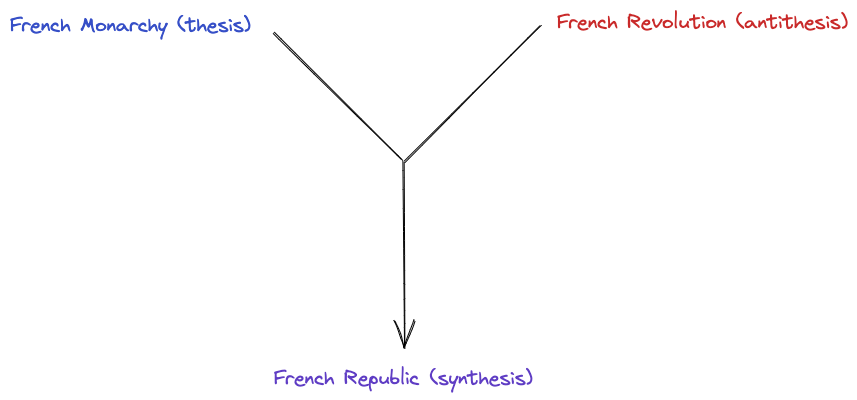

>"Those who cannot remember the past are condemned to repeat it." - George Santayana

The present can seem like a very unstable and turbulent time. It seems as if the world is splitting itself apart, becoming more polarized and opinionated. However, to understand the direction the world is headed, we need to look back in the past for answers. 

Now, Hegel is notorious for being incredibly difficult to read. His works are often long-winded and use poor english to convey his thoughts. However, his ideas are incredibly important to understand. However, one of his ideas is incredibly important to understand: the dialectic. When broken down, the dialectic is not a very complicated idea.

The dialectic refers to a method of reasoning and argumentation that involves the examining opposing ideas. It contains three parts: the thesis, antithesis, and synthesis. The thesis and antithesis are opposing ideas. The synthesis is the the merging of the two ideas, reconciling them to form a new idea that contains good attributes of both the thesis and antithesis. It is often associated with philosophical traditions and has been used as a tool for intellectual inquiry and debate throughout history.

Hegel's dialectical reasoning states that history progresses through a series of conflicts and resolutions. According to Hegel, the current world order can be viewed as the thesis. New, opposing ideas that are in conflict with the current world order are the antithesis. The synthesis is the new world order that is formed after the conflict between the thesis and antithesis is resolved.

Here's a diagram of the dialectic:

Hegel used the example of the French Revolution to explain his idea. The French Monarchy was the thesis, the current world order. The drastic opposite of the French Monarchy was the French Revolution, the antithesis. The synthesis was the new world order that was formed after the French Revolution, which was the French Republic.

<!--
Using the dialectic, we can visualize the modern day as just a series of Hegelian dialectics. I think the best example of this is the current state of affairs in Israel. This involves two applications of the dialectic at a broad level:

Origins:

1. Thesis: Pre-1948 Jewish Migration and Zionist Movement
- The Jewish diaspora and persecution throughout history laid the foundation for the Zionist movement, which sought to establish a Jewish homeland in Palestine.
- The Jewish migration to Palestine increased during the late 19th and early 20th centuries, leading to conflicts with the Arab population already residing there.

2. Antithesis: Arab Nationalism and Anti-Zionist Sentiment

- The rise of Arab nationalism coincided with the growing Jewish presence in Palestine.
- Tensions escalated as the Arab population expressed opposition to the Zionist movement, fearing dispossession of their land and the establishment of a Jewish state.

3. Synthesis: 1947 UN Partition Plan and Creation of Israel

- In 1947, the United Nations proposed a partition plan to divide Palestine into separate Jewish and Arab states.
- While the Jewish leadership accepted the plan, Arab states and Palestinian Arabs rejected it, leading to the 1948 Arab-Israeli War.
- Israel declared independence in 1948, leading to a synthesis of sorts by establishing a Jewish state but failing to resolve the broader conflict.

Current state:

1. New Thesis: Post-1948 Arab-Israeli Conflicts and Occupation

- The establishment of Israel led to ongoing hostilities between Israel and its neighboring Arab states, including wars in 1956, 1967, and 1973.
- The Israeli victory in the 1967 Six-Day War resulted in the occupation of the West Bank, Gaza Strip, and other territories, leading to further tensions and resistance from Palestinians.

5. New Antithesis: Palestinian Nationalism and Intifadas

- Palestinian nationalism emerged as a response to Israeli occupation, leading to the formation of organizations such as the Palestinian Liberation Organization (PLO).
- The First Intifada (1987-1993) and the Second Intifada (2000-2005) saw widespread Palestinian uprisings against Israeli control, with both sides engaging in violent confrontations.

At the current state, there is no synthesis. However, the Hegelian synthesis can take decades to come to fruition, as seen with the French Revolution. 

The Israel-Palestine conflict is just one example, but nearly every single current social or political issue can be visualized through the Hegelian dialectic.  -->

*Expect more philosophy to come. - RA*