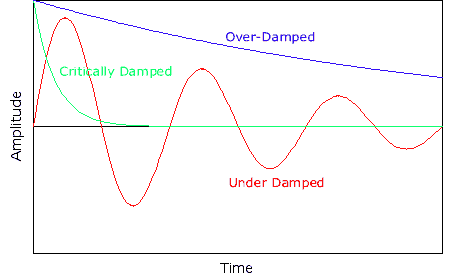
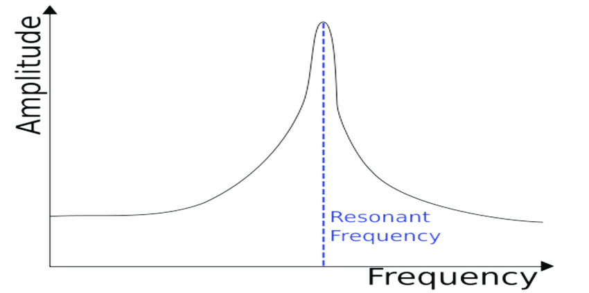

 

## Intro

This article is going to be math heavy. Be warned.

According to Google, an oscillator is a mechanical or electronic device that works on the principles of oscillation: a periodic fluctuation between two things based on changes in energy.

If you take a system in equilibrium and give it a little kick, it will vibrate. We can model this with a cosine function: 

$$x = A \cos (\omega_0 t + \phi)$$

This equation relates the position of the oscillator to the amplitude ($A$), the angular frequency ($\omega$), time ($t$), and the phase shift $\phi$. What are all of these things? The amplitude is defined as the maximum displacement. The angular frequency is a fixed constant of the system. You can think of the phase shift as the offset of the system. We can ignore this term, as it won't affect these calculations. We can take the derivative of this function with the chain rule to find the velocity function:

$$\frac{dx}{dt} = v = - A \omega_0 \sin (\omega_0 t + \phi)$$

We can take the second derivative to find the acceleration function:

$$\frac{d^2x}{dt}= a= - A {\omega_0^2} \cos (\omega_0 t + \phi)$$

Something in this function looks familiar. That's right! The acceleration function contains the position function (look at the cosine function):

$$-{\omega_0^2} \cdot  A  \cos (\omega_0 t + \phi) = -{\omega_0^2}x$$

So, to put everything together:

$$\frac{d^2x}{dt}= -{\omega_0^2}x$$

This is the equation for simple harmonic motion.

## Springs 1

Take a mass on a spring:

If you pull it, it will try to return to equilibrium. We can use Newton's Second Law along with Hooke's Law to give us:

$$ F = ma = -kx$$

We can rewrite this as:

$$ m\frac{d^2x}{dt^2} = -kx$$

Wait a minute, another differential equation for the second derivative of x! Let's see if we can equate the two to find the angular frequency for a spring. Divide both sides by m:

$$ \frac{d^2x}{dt^2} = -\frac{k}{m}x$$

And when we equate them:

$$-\frac{k}{m}x =  -{\omega_0^2}x$$

We find that $\omega_0^2 = \frac{k}{m}$, and as a result:

$$\omega_0 = \sqrt{\frac{k}{m}}$$

This is great! We have the angular frequency for a spring. We also know that this is a fixed number based on the properties of the spring itself. From these relationships:

$$f = \frac{\omega}{2\pi}$$
$$T = \frac {2 \pi}{\omega}$$

We can get these equations:

$$\omega_0 = \sqrt{\frac{k}{m}}$$
$$f = \frac{1}{2\pi}\sqrt{\frac{k}{m}}$$
$$T = 2 \pi \sqrt{\frac{m}{k}}$$

Now, anyone who's taken an introductory physics course should vaguely recognize these equations. So this is where they come from!

## Pendulums

Imagine a massless rod of length $L$ that supports a mass $m$ at the end. 

Instead of the mass moving in one dimesion, it moves in a circle. We could try to find some relationship in two dimensions for the motion of a circle, but we can do something much easier. Instead of tracking $x$ and $y$, we can track $\theta$, the angle that the mass has moved to. We can rewrite our simple harmonic equation as:

$$\frac{d^2\theta}{dt^2} = -\omega_0^2\theta$$

Okay, so if we're dealing with angles, it's easier to work with torque. We can define torque as:

$$\tau = I\frac{d^2\theta}{dt^2} = r \times F$$

Where $\tau$ represents torque, $I$ represents moment of inertia, $r$ represents the radius, and $F$ represents the force exerted on the mass. In this scenario, our moment of inertia is 
$$I = mL^2$$ 

due to the mass being treated as a point mass. For our second definition of torque, we can use:

$$r \times F = rF \sin \theta $$

But what is the "restoring" force acting on the pendulum? Well, in this case, we only have gravity acting on the pendulum, so that must be our restoring force. Therefore, we get:

$$(mL^2) \frac{d^2\theta}{dt^2} = mgL \sin \theta$$

Solving for the second derivative of theta:
$$ \frac{d^2\theta}{dt^2} = \frac{g}{L} \sin \theta$$

So, we have a bit of a problem. Right now, we can't solve this equation with our SHM equation, because we need to isolate theta. Thankfully, due to the Taylor series of sine:

$$\sin \theta = \sum_{n=1}^{\infty} \frac{(-1)^n}{(2n+1)!}\theta^{2n+1}$$

We know that for small values of theta, $\sin \theta = \theta$! Therefore, we can rewrite the equation as:

$$ \frac{d^2\theta}{dt^2} = \frac{g}{L}\theta$$

This is called the small-angle approximation. From this, we get:

$$\omega_0 = \sqrt{\frac{g}{L}}$$
$$f = \frac{1}{2\pi} \sqrt{\frac{g}{L}}$$
$$T = {2\pi} \sqrt{\frac{L}{g}}$$

Surprisingly, we see that the period of a pendulum is not dependent on the mass of the pendulum! This is a very useful result. 

## A Math Detour

Using the Taylor Series of $e$, $\sin$, and $\cos$, we get Euler's Formula:
$$e^{i\theta }=\cos \theta +i\sin \theta $$
$$e^{-i\theta }=\cos \theta -i\sin \theta$$

Using Euler's formula, we can reconstruct the trigonmetric functions:
$$\cos \theta =\frac{e^{i\theta }+e^{-i\theta }}{2}$$
$$\sin \theta =\frac{e^{i\theta }-e^{-i\theta }}{2}$$

Suppose we have a complex number $z = x + iy$. Using Euler's formula, we can write $z$ as:

$$z = |z|e^{i\phi}=$$

With:
$$|z| = \sqrt{x^2+y^2}$$
$$\tan \phi = \frac{y}{x}$$

This is called the polar form of a complex number.

## Springs 2: Electric Boogaloo

Let's write down our simple harmonic equation:
$$\frac{d^2x}{dt^2}=-\omega _0^2x$$

We're going to attempt to write a general solution for this. This will seem unecessary at first, but as things become increasingly complicated, the ability to understand this is extremely useful.

We can move everything to one side and write:

$$\frac{d^2x}{dt^2}+\omega _0^2x=0$$

Now, looking at the equation, the 2nd derivative of the function (x) must be a version of itself. We know two functions that could match this description: $e^x$ or one of the trignometric equations. Let's go with $e^x$ as our "ansatz" ( educated guess in German):
$$x=Ae^{\alpha t}$$

This is our guess for what x could be. We can plug in our guess to the equation and differentiate to get:

$$\alpha ^2Ae^{\alpha t}+\omega _0^2Ae^{\alpha t}=0$$

Factoring:

$$A\left(\alpha ^2+\omega _0^2\right)e^{\alpha t}=0$$ 

Now, we could make this equation satisfy 0 by setting $A$ equal to 0 or $t$ equal to 0. These are trivial solutions. To find a general solution, we must solve:

$$\alpha ^2+\omega _0^2=0$$

This is pretty straightforward, and we get:

$$\alpha =\sqrt{-\omega _0^2}=\pm i\omega _0$$

Wait a minute. Does this mean that we have two solutions? That doesn't seem right. But it is. Let's write our two solutions down:

$$x_1\left(t\right)=Ae^{i\omega_0 t}$$
$$x_2\left(t\right)=Be^{-i\omega_0 t}$$

Because the original differential equation did not depend on higher powers of x (only the derivatives of x), we call this a linear differential equation. Linear differential equations obey the principle of superposition, which states:

> If $y_1(t)$ and $y_2(t)$ are two solutions to a linear differential equation then so is $$y(t) = c_1y_1(t) + c_2y_2(t)$$

If that doesn't make any sense, it means that the sum of both solutions is a general solution. You can also multiply either sum by a different coefficient. 
From this principle, we can write:
$$x\left(t\right)=Ae^{i\omega _0t}+Be^{-i\omega _0t}$$

But we have imaginary units! To verify that this equation is real, we can check if it is its own complex conjugate:

$$x^{\ast }\left(t\right)=A^{\ast }e^{-i\omega _0t}+B^{\ast }e^{i\omega _0t}$$

If we want $x^{\ast }\left(t\right)$ to equal $x\left(t\right)$, we must demand that:

$$B=A^{\ast }$$
$$A=B^{\ast }$$

We can use the first condition and substitute:
$$x\left(t\right)=Ae^{-i\omega_0 t}+A^{\ast }e^{-i\omega_0 t}$$

But we still aren't done! A doesn't have to be real, it can be a complex number. To ensure that A is represented as a real number, we can use the definition:

$$A=\left|A\right|e^{i\phi }$$

Substituting that in, we get:

$$x\left(t\right)=\left|A\right|e^{i\left(\omega_0 t+\phi \right)}+\left|A\right|e^{-i\left(\omega_0 t+\phi \right)}$$

This looks really familiar! Using Euler's formula, we get:

$$x\left(t\right)=2\left|A\right|\cos \left(\omega_0 t+\phi \right)=C\cos \left(\omega_0 t+\phi \right)$$

Which is our original equation. Great! We now know a somewhat general method for solving this differential equation. 

## Damping

Let's kick things up a notch. For our mass and spring system, we now have a frictional force acting the other way. We then take our SHM equation and add a new term to represent this "damping":

$$m\frac{d^2x}{dt^2}=-kx-b\frac{dx}{dt}$$

Bringing everything to one side:

$$m\frac{d^2x}{dt}+b\frac{dx}{dt}+kx=0$$ 

The b represents a damping constant. Now, this looks like a giant pain to solve. Let's make some quick adjustments by dividing everything by m:

$$\frac{d^2x}{dt}+\gamma \frac{dx}{dt}+\omega _0^2x=0$$

Where $\gamma$ = $\frac{b}{m}$.

There are three types of damping, shown in the graph below.

### Over-damped Oscillator 

In an over-damped oscillator, the system moves to equilibrium without oscillating back and forth. In this case,

$$\frac{\gamma }{2}>\omega _0$$

Once again, we make our "anzatz":

$$x=Ae^{\alpha t}$$

Substituting, differentiating, and expanding, we get:

$$A\left(\alpha ^2+\alpha \gamma +\omega _0^2\right)e^{\alpha t}=0$$

To generate non-trivial solutions, we must set the details inside the brackets equal to zero:

$$\alpha ^2+\alpha \gamma +\omega _0^2=0$$

Using the quadratic equation to solve, we get:

$$\alpha = - \frac{\gamma }{2}\pm \sqrt{\left(\frac{\gamma }{2}\right)^2-\omega _0^2}$$

Now, we know that anything inside the square root will never be negative due to the condition placed on our damping constant. We also know it is not big enough to create a positive number. Therefore, $\alpha$ will always be negative. 

Writing out our solution, we get:

$$x\left(t\right)=Ae^{\alpha _+t}+Be^{\alpha _-t}$$

As expected, there is no way we can use Euler's formula to generate sines and cosines, because the system is not oscillating back and forth. Instead, the system is represent by a decreasing exponential (as $\alpha$ is always negative).

To solve for A and B in this case, we can set up a system of equations, given we know the following:

$$x\left(0\right)=A+B$$
$$v\left(0\right)=\alpha _+A+\alpha _-B$$

### Under-damped Oscillator
In an under-damped oscillator, the system will oscillate, but the amplitute will slowly decrease from its maximum amplitude. 

We can assume: 
$$\frac{\gamma}{2} < \omega_0$$

And using our general solution from the over-damped solution, we once again get:

$$\alpha = - \frac{\gamma }{2}\pm \sqrt{\left(\frac{\gamma }{2}\right)^2-\omega _0^2}$$

However, because $\frac{\gamma}{2} < \omega_0$, whatever is inside the exponent will be negative. We can explicitly rewrite this as:

$$\alpha =-\frac{\gamma }{2}\pm i\sqrt{\omega _0^2-\left(\frac{\gamma }{2}\right)^2}$$

For easier notation, we can write:

$$\omega '=\sqrt{\ \omega _0^2-\left(\frac{\gamma }{2}\right)^2}$$

$$ \alpha = -\frac{\gamma }{2}\pm i \omega'$$

Therefore, our solution is:

$$x\left(t\right)=Ae^{-\left(\frac{\gamma t}{2}+i\omega 't\right)}+Be^{-\left(\frac{\gamma t}{2}-i\omega 't\right)}$$

We can see that A and B are complex conjugates of each other. Therefore, 

$$A = |A|e^{i\phi_0}$$
$$B = |A|e^{-i\phi_0}$$

Substituting this definition and simplifiying, we get:
$$x\left(t\right)=\left|A\right|e^{-\frac{\gamma }{2}}\left(e^{i\left(\omega 't+\phi _0\right)}+e^{-i\left(\omega 't+\phi _0\right)}\right)$$

And by using Euler's formula:

$$x\left(t\right)=Ce^{-\frac{\gamma t}{2}}\cos \left(\omega 't+\phi _0\right)$$

This matches our expectations, as the graph of an under-damped oscillator almost looks like a squeezed cosine function, similar to what we would expect from this equation here.

### Critically Damped Oscillator

In an over-damped oscillator, the system moves to equilibrium without oscillating back and forth in the shortest time possible. It's the middle case between an under-damped and over-damped oscillator. In this case,

$$\frac{\gamma }{2}=\omega _0$$

We can use our standard solutions for $\alpha$ here:

$$\alpha = - \frac{\gamma }{2}\pm \sqrt{\left(\frac{\gamma }{2}\right)^2-\omega _0^2}$$

But notice that everything in the square root vanishes, as both terms are equal! Therefore, our solutions for $\alpha$ are:

$$\alpha = - \frac{\gamma }{2}\pm 0$$

We have a differential equation with repeated roots as our solution. Therefore, our solution becomes

$$x\left(t\right)=Ae^{-\frac{\gamma t}{2}}+Bte^{-\frac{\gamma t}{2}}$$

This comes from the rules for second order differential equations with repeated roots. 

Is your head spinning? Well, that's bad news, because we still have one section left.

### Driven Oscillators
Take our mass-spring system, including friction. Let's assume this is an under-damped system. We now introduce a cyclic force:

$$F_0\cos \omega t$$

Now, our equation looks like:

$$\frac{d^2x}{dt}+\gamma \frac{dx}{dt}+\omega _0^2x=\left(\frac{F}{m}\right)\cos \omega t$$

The force is divided by mass because we did this in a previous step (see how we created the gamma term). This is a really annoying equation to solve for. We can instead use a hack to create an equation in terms of $e$. Let's make another equation, this time in terms of $y$:

$$ \frac{d^2y}{dt}+\gamma \frac{dy}{dt}+\omega _0^2y=\left(\frac{F}{m}\right)\sin \omega t$$

And multiply across by $i$:

$$i\frac{d^2y}{dt}+i\gamma \frac{dy}{dt}+i\omega _0^2y=\left(\frac{F}{m}\right)i\sin \omega t$$

Now, I'm sure some of you can see where I'm going with this. Going back to the definition of complex numbers:

$$z=x+iy$$

We can manufacture a new equation that uses this:

$$\frac{d^2z}{dt}+\gamma \frac{dz}{dt}+\omega _0^2z=\left(\frac{F}{m}\right)e^{i\omega t}$$

We can solve this equation, and them dump the imaginary part. Let's make our preliminary guess, which looks a bit different now:

$$z=z_0e^{i\omega t}$$

Substituting, we get:
$$-\omega ^2z_0e^{i\omega t}+i\omega \gamma z_0e^{i\omega t}+\omega ^2z_0e^{i\omega t}=\frac{F_0}{m}e^{i\omega t}$$
$$\left(-\omega ^2+i\omega \gamma +\omega _0^2\right)z_0e^{i\omega t}=\frac{F}{m}e^{i\omega t}$$
$$\left(-\omega ^2+i\omega \gamma +\omega _0^2\right)z_0=\frac{F}{m}$$
$$z_0=\frac{\frac{F}{m}}{-\omega ^2+i\omega \gamma +\omega _0^2}$$

Great! We have a solution (although a big large) for $z_0$. Let's clean this up first by defining impedence ($I$):

$$I=-\omega ^2+i\omega \gamma +\omega _0^2$$

And then we can use all of this for $z$:

$$z=z_0e^{iwt}=\frac{\frac{F}{m}\cdot e^{i\omega t}}{I}$$

However, it is visible that $I$ is a complex number. To ensure only real numbers remain, we can use the polar form of complex numbers:

$$z=\frac{\frac{F_0}{m}\cdot e^{i\omega t}}{\left|I\right|e^{i\phi }}$$
$$z=\frac{\frac{F_0}{m}}{\left|I\right|}e^{i\left(\omega t-\phi \right)}$$

This is exactly what we need. We can extract the real part and get:

$$x=\frac{F_0}{m\left|I\right|}\cos \left(\omega t-\phi \right)$$

We're almost there! We need to include the transient solution (movement before the damping decays) alongside the steady-state solution (the driven part) Knowing, for an under-damped system:

$$x_c\left(t\right)=Ce^{-\frac{\gamma t}{2}}\cos \left(\omega 't+\phi _0\right)$$

We get the complete solution:
$$x\left(t\right)=\frac{F_0}{m\left|I\right|}\cos \left(\omega t-\phi \right)+Ce^{-\frac{\gamma t}{2}}\cos \left(\omega 't+\phi _0\right)$$

Where:

$$\omega '=\sqrt{\ \omega _0^2-\left(\frac{\gamma }{2}\right)^2}$$
$$\left|I\right|=\sqrt{\left(\omega _0^2-\omega ^2\right)^2+\left(\omega \gamma \right)^2}$$
$$\tan \phi =\frac{\omega \gamma }{\omega _0^2-\omega ^2}$$

This is a LOT. Congrats if you made it this far (send me a message if you did!) 

One last thing to cover: the natural frequency and resonance. 

The natural frequency is the frequency at which a system would oscillate if there were no driving and no damping force. Resonant frequency is the natural frequency at which an object vibrates with a higher amplitude, or when a system is driven at its natural frequency.

The resonant frequency is based on the maximum amplitude as $\omega$ increases:

$$x_0=\frac{F}{m\sqrt{\left(\omega _0^2-\omega ^2\right)+\left(\omega \gamma \right)^2}}$$

This causes the graph to look something like this:

This massive spike is where resonance occurs. Think about a wineglass breaking when someone sings a loud note at the right pitch: that's an example of resonance. You are exerting a driving force on the oscillating glass, and when your frequency matches the resonant frequency, the glass shatters. 

Well, that's all folks! See you next time.

