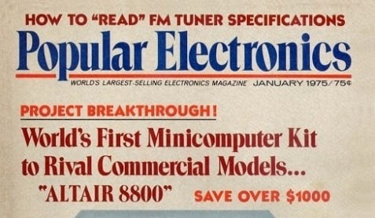
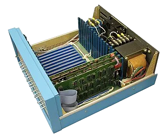



  
 

This is an advertisement for the Altair 8800 personal computer in the Popular Electronics Magazine. The Altair 8800 was the first commercially successful personal computer kit and was sold beginning in January 1975, when it was featured on the cover of the Popular Electronics magazine. This magazine had been the life and soul of the personal electronics culture in America, and being nominated to the cover marketed the Altair 8800 massively. It was sold as a DIY kit for around $400, and it was a plain metal box with switches and blinking lights. It was nowhere close to the PCs that consumers have today, but it was a massive success with the “hackers” of the 1970s.

The Altair 8800 being featured on the cover of Popular Electronics represents a turning point in hacking culture: the start of the personal computing revolution. This ad was chosen for our exhibit because it symbolizes the moment when computers entered the personal home, kickstarting the PC revolution. Previously, computers had been restricted to universities and corporations and took up entire rooms' worth of space. However, the Altair 8800 could easily be used at home by any amateur programmer or engineer because it took up only a single desk’s worth of space, a far cry from the giant boxes that previously dominated the computer industry.


  
 

The Altair 8800 was now able to be used in the American home for education, creativity, and experimentation. For Americans in the 1970s, the Altair 8800 opened a window into home-based computing. It also exposed a new generation of scientists and engineers, like Bill Gates and Steve Jobs, to computers and programming and set the stage for future consumer-friendly electronics, such as the Apple I and IBM PC. Today, nearly every American citizen has access to a computer of some kind, whether that be a laptop, PC, or even phone. 

On a larger scale, the popularization of the Altair 8800 was a shift from centralized computing to decentralized, individual computing, which gave power to the individual user. This shift represented a culture focused on a grassroots-style individual hacking culture, which differed from the traditional, bland, and somewhat academic setting that computers had originated from. The creation of the Altair 8800 was a major turning point in establishing the “indie hacker” culture that still exists today. In summary, the Altair 8800 changed American life permanently by introducing personal computers to the general population, kicking off the PC revolution. 

---