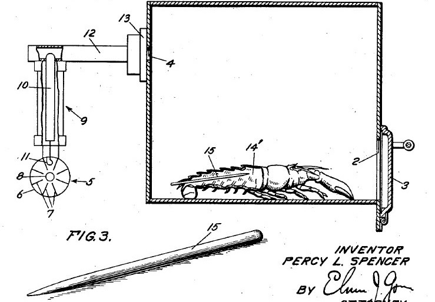

The Raytheon Radarange was the first commercially available microwave. A clunky, chrome box weighing over 340 kg and costing over $5,000, the Radarange wasn’t widely adopted at the time. However, this artifact was chosen because it was a foundational step in advancing consumer food technology by changing the way Americans prepared food.

The Radarange was invented as a result of melted chocolate. In a Raytheon lab, Percy Spencer realized that his candy bar melted when he placed his chocolate bar next to a magnetron. Spencer realized that the magnetron (a special type of vacuum tube) was producing electromagnetic radiation, causing his chocolate bar to melt. Fascinated by this result, Spencer then took a bag of corn kernels and placed them near his magnetron, all of which popped into fresh, hot popcorn all over his lab. Presumably after a few laughs, Spencer and Raytheon realized the true potential of the technology they had on their hands and refined it to create the Radarange, sold starting in 1947. 

The Radarange and its successors were some of the most impactful inventions for American consumers. Americans could now enjoy (debatably) uniformly heated meals in a fraction of the time it would take to cook with a typical gas stove. This led to a new class of food: microwave meals, which allowed many Americans at home to enjoy gourmet-style meals while not having to lift a finger while cooking. These microwaves exhibited massive consumer surplus, especially as they became more advanced and more affordable, as their utility outweighed their price. 

The microwave also had other, intangible impacts on American home life. Writer David Perell coined the term “microwave economy” to describe the drive to use wealth for scaling and utility, often at the expense of aesthetics, beauty, and meaning. Using the example of microwave meals, Perell argues that Americans value measurability and consistency in goods over the depth, soul, and aesthetics of goods. In the end, the microwave didn’t just change how Americans cooked: it reshaped how they lived, valued time, and thought about convenience in a new technological age. 

-----